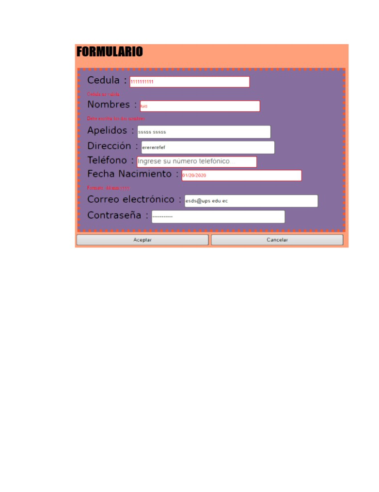
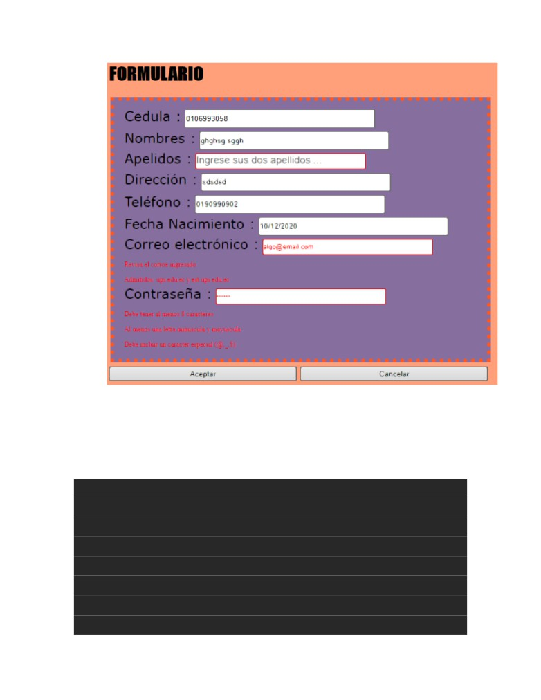
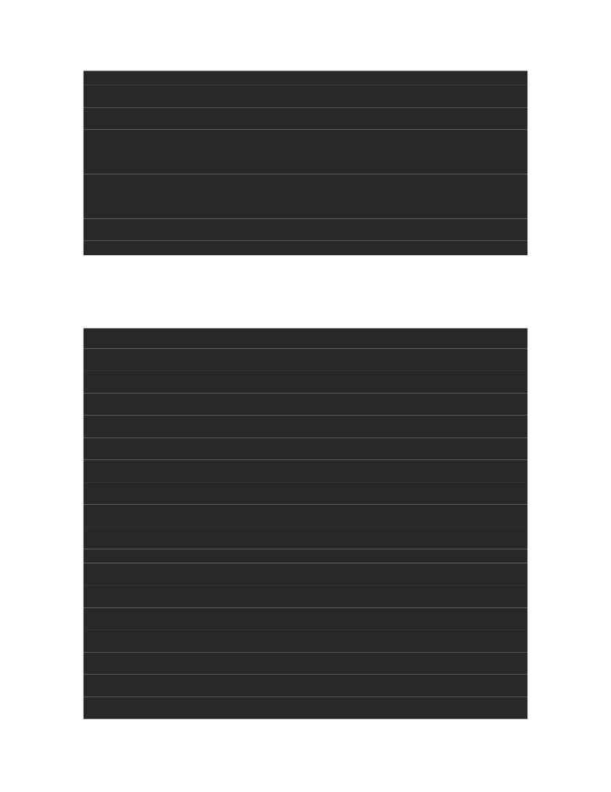
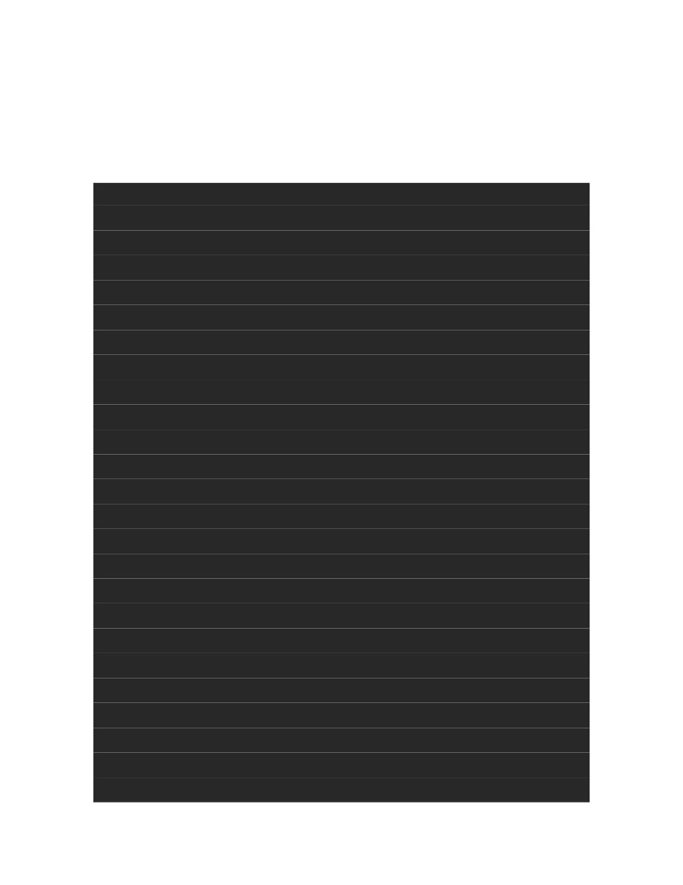
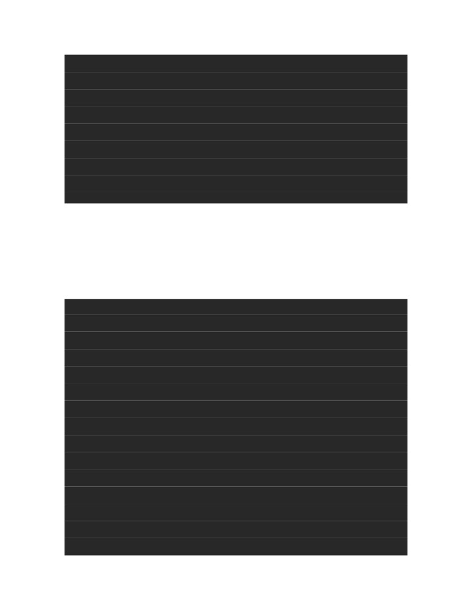


REPOSITORIO
Link del Repositorio:
[https://github.com/IvanUlloa098/Practica03-UlloaIvan.git](https://github.com/IvanUlloa098/Practica03-UlloaIvan.git)
Usuario: IvanUlloa098
Commits:
1. Diseñar una interfaz en HTML que permita ingresar los siguientes
campos en un
formulario: cedula, nombres, apellidos, dirección, teléfono, fecha de
nacimiento,
correo electrónico y contraseña. Luego, usando funciones de JavaScript
se pide
validar que todos los campos han sido ingresados, además; que los
valores
ingresados en cada campo del formulario sean correctos teniendo en
cuenta las
siguientes condiciones:

a) Validar Cedula
El método validarCedula() recibe el elemento y primeramente verifica que
el
numero de caracteres sea igual a 10 para de esta manera continuar con el
método de validación que es aquel que se ha llevado realizando desde
siempre.
function validarCedula(elemento) {
var texto = elemento.value;
var bandera=false;
var total = 0;
if (texto.length == 10){

for(i = 0; i \< (texto.length-1); i++){
if (i%2 === 0) {
var aux = texto.charAt(i) \* 2;
if (aux \> 9) aux -= 9;
total += aux;
} else {
total += parseInt(texto.charAt(i));
}
}
total = total % 10 ? 10 - total % 10 : 0;
if (texto.charAt(texto.length-1) == total) {
bandera=true;
}else{
elemento.style.border = '1px red solid';
elemento.className = 'error';
bandera=false;
}
}
return bandera;
}
Al final la bandera indicará si se encuentra correcta o no.
b) Validar Nombres
Este método (dosPalabras) es simple e involucra contar la cantidad de
espacios en blanco existentes en el elemento input, sin existen más de
un
espacio o “0” espacios la bandera cambiará a falso. Esto juntado con un

método de verificación al ingresar cada letra, evitando el ingreso de
caracteres especiales o números.
function dosPalabras(elemento) {
var codigo;
var count=0;
var bandera=true;
//var elemento = document.getElementById("nombres");
var texto = elemento.value;
for(var i = 0; i \< texto.length; i++) {
codigo = texto.charCodeAt(i);
if (codigo == 32) {
count++;
}
}
if(count\>1){
//advertencias = advertencias+'\\nERROR: Solo dos '+elemento.id;
//alert('ERROR: Solo dos '+elemento.id);
elemento.style.border = '1px red solid';
elemento.className = 'error';
bandera = false;
} else if (count==0) {
//alert('ERROR: Dos '+elemento.id+' neccesarios');

//advertencias = advertencias+'\\nERROR: Dos '+elemento.id+' neccesar
ios';
elemento.style.border = '1px red solid';
elemento.className = 'error';
bandera = false;
}
return bandera;
}
El método para validar los caracteres. Lo que hace es verificar el
carácter
ingresado y compararlo con su código Unicode, el que debe estar en un
intervalo determinado. Se incluye también el uso de espacio (\#32):
function validarLetras(elemento) {
if(elemento.value.length \> 0){
var codigo = elemento.value.charCodeAt(elemento.value.length-1);
console.log(codigo);
if((codigo \>= 97 && codigo \<= 122) ||
(codigo \>= 65 && codigo \<= 90) || (codigo == 32)){
return true;
} else {
elemento.value = elemento.value.substring(0, elemento.value.
length-1);
return false;
}
} else{
return true;
}

}
c) Validar Apellidos
Se utilizan los mismos dos métodos anteriores (dosPalabras y
validarLetras)
al ser una situación idéntica a los nombres.
d) Validar Teléfono
El método es similar a validarLetras, en este caso valida el intervalo
de
codigos para los números arábigos. Se añade una funcionalidad más que es
la de verificar que solo se puedan ingresar 10 números (método también
usado en el campo Cédula).
function validarNumeros(elemento) {
if(elemento.value.length \> 0 && elemento.value.length \<= 10){
var codigo = elemento.value.charCodeAt(elemento.value.length-1);
console.log(codigo);
//alert(elemento.value.length);
if(codigo \>= 48 && codigo \<= 57){
return true;
} else {
elemento.value = elemento.value.substring(0, elemento.value.leng
th-1);
return false;
}
} else if (elemento.value.length \> 10) {
elemento.value = elemento.value.substring(0, elemento.value.length-
1);
return false;
} else{
return true;

}
}
e) Validar Fecha de Nacimiento
Se utiliza un método tipo validarLetras, pero que solo incluya números y
el
símbolo “/”. Al momento de validar el formato no se usan expresiones
regulares, en su lugar se cuenta el número de “/” y sus posiciones, de
acuerdo con estas posiciones se procede a separar los distintos números
y
verificar si el día va de 1 a 31, el mes de 1-12 y el año de 1900 a
2020.
function validarCorreo(elemento) {
var codigo;
var count=0;
var texto = elemento.value;
var bandera=false;
//alert(texto);
for(var i = 0; i \< texto.length; i++) {
codigo = texto.charCodeAt(i);
if (codigo == 64) {
count=i;
break;
}
}
if(count != 0) {

//alert(texto.substring(count, texto.length));
if ((texto.substring(count, texto.length) == '@ups.edu.ec')
|| (texto.substring(count, texto.length) == '@est.ups.edu.ec')){
bandera=true;
} else {
elemento.style.border = '1px red solid';
elemento.className = 'error';
bandera = false;
}
}
//alert(count);
return bandera;
}
function valiarPassword(elemento) {
var codigo;
var may=0, min=0, car=0;
var texto = elemento.value;
var bandera=true;
//alert(texto);
if (texto.length\>=8) {
for(var i = 0; i \< texto.length; i++) {
codigo = texto.charCodeAt(i);
if (codigo \>= 97 && codigo \<= 122) {

min=1;
} else if (codigo \>= 65 && codigo \<= 90) {
may=1;
} else if (codigo == 64) {
car=1;
} else if (codigo == 36) {
car=1;
} else if (codigo == 95) {
car=1;
}
}
} else {
elemento.style.border = '1px red solid';
elemento.className = 'error';
bandera = false;
}
if (min!=1 && may!=1 && car!=1) {
elemento.style.border = '1px red solid';
elemento.className = 'error';
bandera = false;
}
return bandera;
}
f) Validar Email

Es este método lo primero que se hace es validar la existencia de “@”
(\#64)
por medio de su Unicode. Cuando se encuentro el símbolo se procede a
contar el número de caracteres antes de dicho símbolo, si es menor a
tres se
anula el siguiente paso. El último paso es simple, solo queda utilizar
substring() para determinar si el dominio es permitido.
function validarCorreo(elemento) {
var codigo;
var count=0;
var texto = elemento.value;
var bandera=false;
//alert(texto);
for(var i = 0; i \< texto.length; i++) {
codigo = texto.charCodeAt(i);
if (codigo == 64) {
count=i;
break;
}
}
if(count != 0) {
//alert(texto.substring(count, texto.length));
if ((texto.substring(count, texto.length) == '@ups.edu.ec')
|| (texto.substring(count, texto.length) == '@est.ups.edu.ec')){
bandera=true;
} else {
elemento.style.border = '1px red solid';

elemento.className = 'error';
bandera = false;
}
}
//alert(count);
return bandera;
}
g) Validar Contraseña
El método primeramente verifica que al menos existan 8 caracteres
escritos,
luego simplemente se hace un barrido de la cadena y se usan banderas que
indican si se han encontrado letras mayúsculas, minúsculas o un símbolo
(@, \_, \$).
function valiarPassword(elemento) {
var codigo;
var may=0, min=0, car=0;
var texto = elemento.value;
var bandera=true;
//alert(texto);
if (texto.length\>=8) {
for(var i = 0; i \< texto.length; i++) {
codigo = texto.charCodeAt(i);
if (codigo \>= 97 && codigo \<= 122) {
min=1;
} else if (codigo \>= 65 && codigo \<= 90) {

may=1;
} else if (codigo == 64) {
car=1;
} else if (codigo == 36) {
car=1;
} else if (codigo == 95) {
car=1;
}
}
} else {
elemento.style.border = '1px red solid';
elemento.className = 'error';
bandera = false;
}
if (min!=1 && may!=1 && car!=1) {
elemento.style.border = '1px red solid';
elemento.className = 'error';
bandera = false;
}
return bandera;
}
